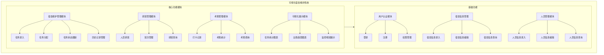
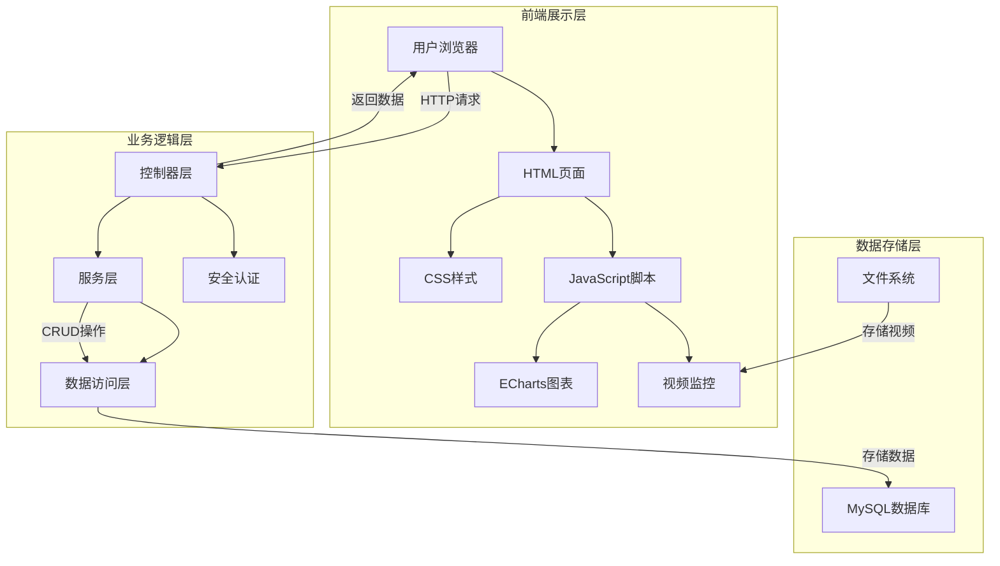

# 系统设计图表

## 1. 系统功能模块图



## 2. 系统E-R图

```mermaid
graph TD
    subgraph 实体
        User[用户实体] --> |管理| Dorm[宿舍实体]
        User --> |管理| MaintainTask[维护任务实体]
        User --> |管理| Schedule[排班实体]
        User --> |管理| Attendance[考勤实体]
        
        Dorm --> |关联| MaintainTask
        MaintainStaff[维护人员实体] --> |执行| MaintainTask
        MaintainStaff --> |拥有| Schedule
        MaintainStaff --> |产生| Attendance
    end
    
    subgraph 关系
        User ||--o{ Dorm : 管理
        User ||--o{ MaintainTask : 管理
        User ||--o{ Schedule : 管理
        User ||--o{ Attendance : 管理
        Dorm ||--o{ MaintainTask : 关联
        MaintainStaff ||--o{ MaintainTask : 执行
        MaintainStaff ||--o{ Schedule : 拥有
        MaintainStaff ||--o{ Attendance : 产生
    end
    
    subgraph 属性
        User["User\n- id: Long\n- username: String\n- password: String\n- name: String\n- phone: String\n- role: String\n- status: Integer"]
        Dorm["Dorm\n- id: Long\n- dormNumber: String\n- building: String\n- floor: Integer\n- roomType: String\n- capacity: Integer\n- status: String\n- description: String"]
        MaintainStaff["MaintainStaff\n- id: Long\n- staffId: String\n- name: String\n- phone: String\n- department: String\n- team: String\n- position: String\n- status: String"]
        MaintainTask["MaintainTask\n- id: Long\n- taskId: String\n- taskType: String\n- dormId: Long\n- dormNumber: String\n- building: String\n- description: String\n- assignStaffId: Long\n- assignStaffName: String\n- status: String\n- priority: String"]
        Schedule["Schedule\n- id: Long\n- scheduleDate: String\n- staffId: Long\n- staffName: String\n- shift: String\n- startTime: String\n- endTime: String\n- position: String\n- status: String"]
        Attendance["Attendance\n- id: Long\n- staffId: Long\n- staffName: String\n- attendanceDate: String\n- checkInTime: String\n- checkOutTime: String\n- status: String"]
    end
```

## 3. 系统架构图

